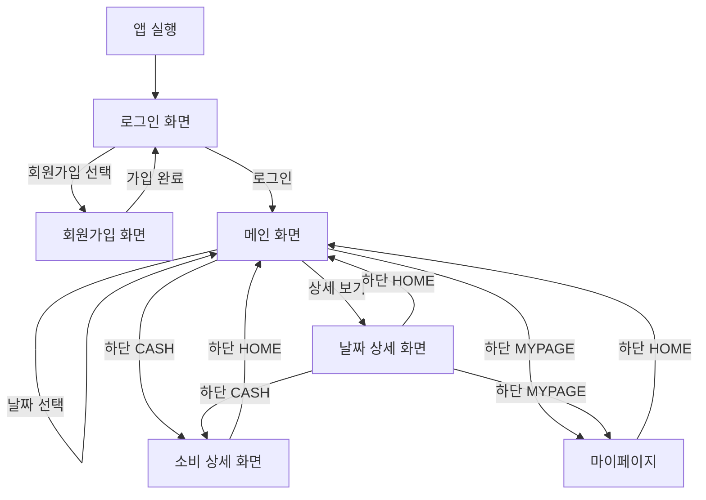
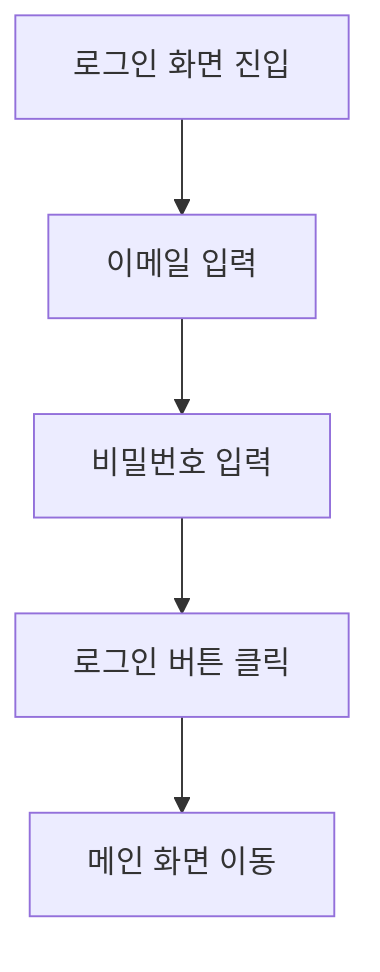
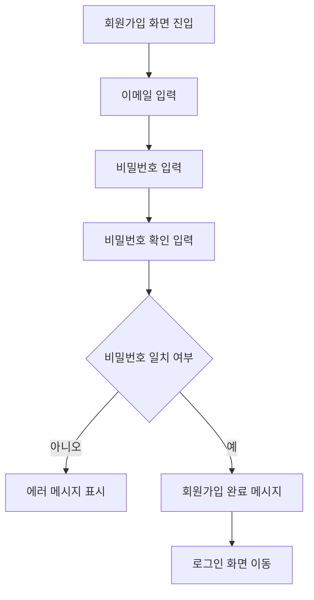
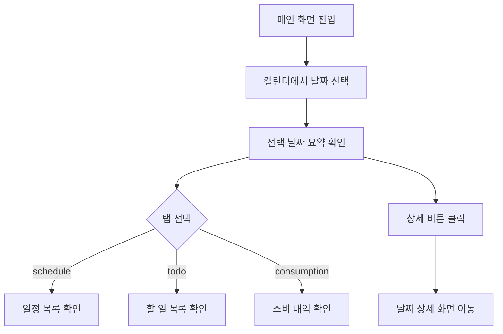
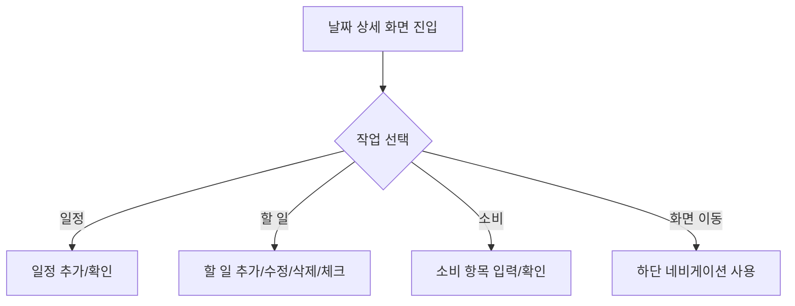

# 애플리케이션 기능 및 사용자 흐름

## 문서 목적

이 문서는 `Cash Diary` 애플리케이션의 주요 기능, 화면 구성, 사용자 흐름, 그리고 현재 구현 범위를 빠르게 이해하기 위한 문서입니다.  
현재 프로젝트는 Flutter 프론트엔드 프로토타입과 별도 Spring Boot 백엔드로 구성되어 있으며, 일부 기능은 UI 중심으로만 구현되어 있습니다.

## 앱 한줄 설명

`Cash Diary`는 날짜 중심으로 일정, 할 일, 소비 내역을 함께 관리하는 개인 다이어리형 앱입니다.

## 핵심 기능

### 1. 회원가입

- 이메일과 비밀번호를 입력해 계정을 생성합니다.
- 비밀번호 확인 일치 여부를 프론트에서 먼저 검사합니다.
- 회원가입 완료 후 로그인 화면으로 이동합니다.

현재 상태:

- 프론트 UI 구현 완료
- 백엔드 회원가입 API 존재
- 실제 연동은 아직 미구현

### 2. 로그인

- 이메일과 비밀번호를 입력해 로그인합니다.
- 현재 프론트에서는 버튼 클릭 시 메인 화면으로 이동합니다.
- 향후 백엔드 로그인 API 연동 시 JWT 토큰 저장이 필요합니다.

현재 상태:

- 프론트 UI 구현 완료
- 백엔드 로그인 API 존재
- 실제 인증 연동 및 토큰 저장 미구현

### 3. 메인 대시보드

- 월간 캘린더를 확인할 수 있습니다.
- 특정 날짜를 선택할 수 있습니다.
- 선택한 날짜의 요약 정보를 확인할 수 있습니다.
- 일정, 할 일, 소비 탭을 전환하며 데이터를 볼 수 있습니다.

현재 상태:

- UI 구현 완료
- 데이터는 로컬 하드코딩 상태
- 백엔드 연동 없음

### 4. 날짜 상세 관리

- 선택한 날짜의 상세 정보를 관리합니다.
- 일정 등록 및 시간대 확인
- 할 일 추가, 수정, 삭제, 체크
- 소비 내역 입력 및 일정과 연결
- 반응형 레이아웃 지원

현재 상태:

- 프론트 UI 및 로컬 상호작용 구현
- 실제 저장 및 서버 동기화 미구현

### 5. 소비 관리

- 현재는 메인 화면과 날짜 상세 화면에서 소비 정보 UI 일부가 표현됩니다.
- 하단 네비게이션의 `CASH` 화면은 아직 플레이스홀더 성격이 강합니다.

현재 상태:

- 백엔드에는 가계부 기록 CRUD API 존재
- 프론트의 전용 소비 화면은 미완성
- API 연동 미구현

### 6. 마이페이지

- 하단 네비게이션의 `MYPAGE` 화면이 존재합니다.
- 현재는 플레이스홀더 수준입니다.

현재 상태:

- 프론트 화면 틀만 존재
- 백엔드 프로필 기능 미구현

## 주요 사용자

예상 사용자:

- 일정과 할 일을 함께 관리하고 싶은 사용자
- 일자별 지출을 기록하고 싶은 사용자
- 하루 단위로 계획과 소비를 한 화면에서 보고 싶은 사용자

## 주요 화면 구성

### 1. 로그인 화면

주요 요소:

- 이메일 입력
- 비밀번호 입력
- 로그인 버튼
- 비밀번호 찾기 버튼
- 회원가입 이동 버튼

사용 목적:

- 기존 사용자의 앱 진입

### 2. 회원가입 화면

주요 요소:

- 이메일 입력
- 비밀번호 입력
- 비밀번호 확인 입력
- 계정 생성 버튼

사용 목적:

- 신규 사용자 계정 생성

### 3. 메인 화면

주요 요소:

- 사용자명 영역
- 월간 캘린더
- 선택 날짜 표시
- 상세 화면 이동 버튼
- 알림 아이콘
- 탭 전환
  - schedule
  - todo
  - consumption
- 하단 네비게이션

사용 목적:

- 날짜 중심 요약 확인
- 상세 화면으로 이동
- 당일 데이터 빠른 탐색

### 4. 날짜 상세 화면

주요 요소:

- 날짜별 상세 정보
- 일정 영역
- 할 일 영역
- 소비 입력/확인 영역
- 추가 모드 전환
- 하단 네비게이션

사용 목적:

- 하루 단위 세부 관리

### 5. 소비 상세 화면

주요 요소:

- 현재는 기본 레이아웃 수준

사용 목적:

- 향후 소비 내역 중심 화면 확장 예정

### 6. 마이페이지 화면

주요 요소:

- 현재는 기본 레이아웃 수준

사용 목적:

- 향후 사용자 정보, 설정, 통계 등 확장 예정

## 사용자 흐름

### 전체 흐름

### 로그인 사용자 흐름

설명:

- 현재는 프론트에서 별도 검증 없이 메인 화면으로 이동합니다.
- 향후에는 백엔드 로그인 API 호출 후 토큰 저장 흐름이 추가되어야 합니다.

### 회원가입 사용자 흐름

### 메인 화면 사용자 흐름

### 날짜 상세 화면 사용자 흐름

## 기능별 상세 시나리오

### 시나리오 1. 신규 사용자가 가입 후 로그인하는 흐름

1. 사용자가 앱을 실행합니다.
2. 로그인 화면에서 `Sign up`을 선택합니다.
3. 회원가입 화면에서 이메일, 비밀번호, 비밀번호 확인을 입력합니다.
4. 비밀번호가 일치하면 가입 완료 메시지를 확인합니다.
5. 로그인 화면으로 돌아옵니다.
6. 로그인 버튼을 눌러 메인 화면으로 진입합니다.

현재 제한:

- 실제 서버 계정 생성과 인증은 아직 연결되지 않았습니다.

### 시나리오 2. 사용자가 특정 날짜의 일정과 할 일을 확인하는 흐름

1. 사용자가 로그인 후 메인 화면에 진입합니다.
2. 캘린더에서 날짜를 선택합니다.
3. 메인 화면에서 선택 날짜의 요약 정보를 확인합니다.
4. `schedule` 탭에서 일정 요약을 확인합니다.
5. `todo` 탭으로 전환해 할 일 목록을 확인합니다.
6. 상세 버튼을 눌러 날짜 상세 화면으로 이동합니다.
7. 날짜 상세 화면에서 세부 내용까지 관리합니다.

### 시나리오 3. 사용자가 소비 내역을 확인하는 흐름

1. 메인 화면에서 `consumption` 탭을 선택합니다.
2. 선택 날짜 기준 소비 항목 요약을 봅니다.
3. 필요 시 날짜 상세 화면으로 이동합니다.
4. 상세 화면에서 소비 관련 입력 또는 확인을 진행합니다.

현재 제한:

- 실제 서버 저장과 동기화는 없습니다.
- 전용 소비 화면은 아직 본격 구현되지 않았습니다.

## 현재 구현 범위와 미구현 범위

### 현재 구현된 것

- 로그인 UI
- 회원가입 UI
- 메인 캘린더 화면
- 날짜 상세 관리 UI
- 하단 네비게이션
- 백엔드 인증 API
- 백엔드 카테고리 API
- 백엔드 가계부 기록 API

### 아직 미구현이거나 미완성인 것

- Flutter와 백엔드 실제 연동
- JWT 저장 및 자동 인증 처리
- 일정 백엔드
- 할 일 백엔드
- 마이페이지 기능
- 소비 상세 화면 완성
- 테스트 정비

## 향후 개선 방향

### 1. 프론트-백 연동

- 로그인/회원가입 API 연동
- 카테고리 조회 연동
- 가계부 기록 CRUD 연동
- 인증 토큰 저장 처리

### 2. 도메인 확장

- 일정 API 설계 및 구현
- 할 일 API 설계 및 구현
- 마이페이지 및 사용자 설정 기능 추가

### 3. 사용자 경험 개선

- 실제 데이터 기반 UI 반영
- 에러 메시지와 로딩 상태 처리
- 날짜별 통계와 시각화 확장

## 요약

`Cash Diary`는 일정, 할 일, 소비를 날짜 중심으로 통합 관리하려는 앱입니다.  
현재는 프론트 UI 프로토타입이 비교적 잘 갖춰져 있고, 백엔드는 인증/카테고리/가계부 기록 API를 제공하고 있습니다.  
다음 단계에서는 프론트-백 연동과 일정/할 일 도메인 확장이 핵심 과제가 됩니다.
